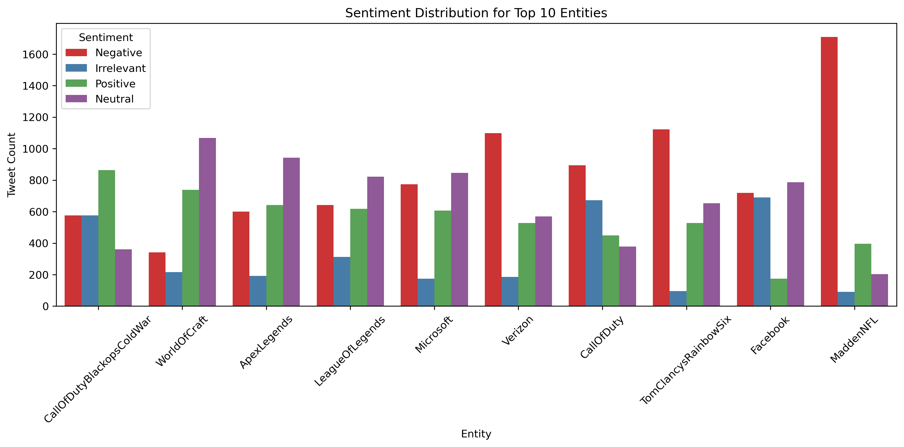
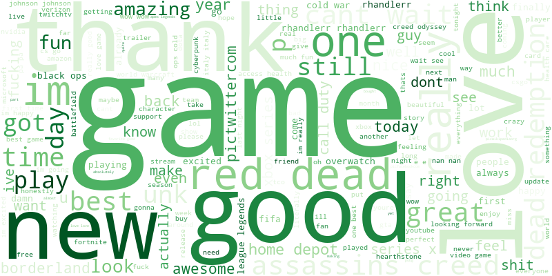
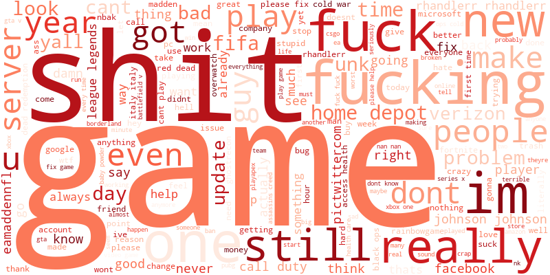
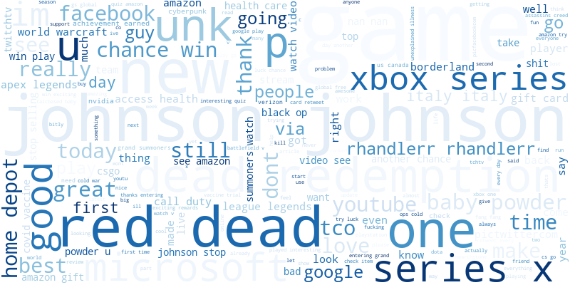
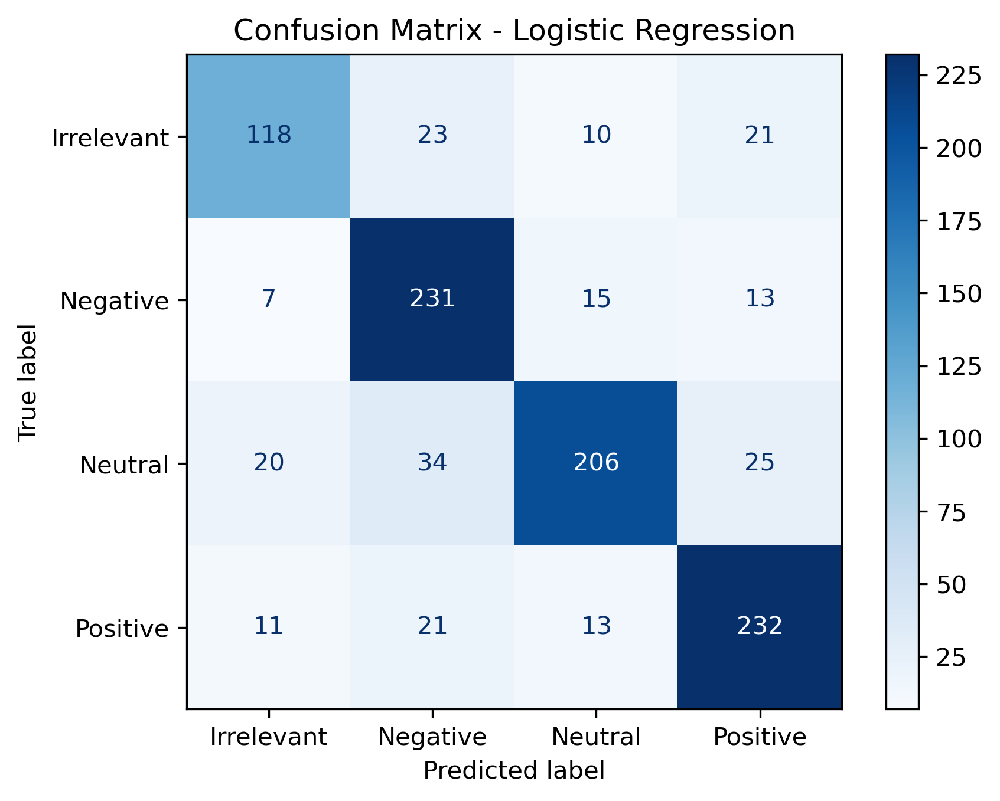

# Task 4 – Twitter Sentiment Analysis | Prodigy Infotech (Data Science Internship)

This project applies **Natural Language Processing (NLP)** techniques to perform sentiment analysis on Twitter data, as part of my **Data Science Internship at Prodigy Infotech**.

---

## Objective

> Analyze and visualize sentiment patterns in tweets using text cleaning, TF-IDF vectorization, and machine learning models to classify sentiment into Positive, Negative, Neutral, or Irrelevant.

---

## Dataset

- `twitter_training.csv` – 74,682 labeled tweets
- `twitter_validation.csv` – 1,000 validation tweets
- **Columns**:
  - `tweet_id` – Unique tweet identifier
  - `entity` – Brand or topic mentioned
  - `sentiment` – Sentiment label (`Positive`, `Negative`, `Neutral`, `Irrelevant`)
  - `text` – Raw tweet content

---

## Preprocessing

- Converted text to lowercase
- Removed:
  - URLs, mentions (@), hashtags (#)
  - Punctuation, numbers, and English stopwords
- Created new column `clean_text` containing cleaned tweet text

---

## Exploratory Data Analysis (EDA)

- Analyzed sentiment distribution across all entities
- Generated **word clouds** per sentiment category

### Sentiment Distribution (Top 10 Entities)


### Word Clouds
**Positive**  


**Negative**  


**Neutral**  


---

## Feature Engineering

- Used **TF-IDF Vectorizer**
  - `max_features=5000`
  - `ngram_range=(1, 2)` for unigrams and bigrams
- Transformed tweets into numerical feature vectors

---

## Model: Logistic Regression

- Trained using Scikit-learn's `LogisticRegression`
- Evaluated on the validation set using precision, recall, F1-score

### Final Results (Validation Set)

| Metric       | Score |
|--------------|-------|
| **Accuracy** | **0.79** (79%) |
| Macro F1     | 0.78  |
| Weighted F1  | 0.79  |

| Sentiment   | Precision | Recall | F1-Score | Support |
|-------------|-----------|--------|----------|---------|
| Irrelevant  | 0.76      | 0.69   | 0.72     | 172     |
| Negative    | 0.75      | 0.87   | 0.80     | 266     |
| Neutral     | 0.84      | 0.72   | 0.78     | 285     |
| Positive    | 0.80      | 0.84   | 0.82     | 277     |

**Confusion Matrix**


---

## Project Structure

```bash
├── datasets/
│   ├── twitter_training.csv
│   └── twitter_validation.csv
├── assets/
│   ├── confusion_matrix_sentiment.png
│   ├── sentiment_per_entity.png
│   ├── wordcloud_positive.png
│   ├── wordcloud_negative.png
│   └── wordcloud_neutral.png
├── twitter_sentiment_analysis.ipynb
└── README.md
